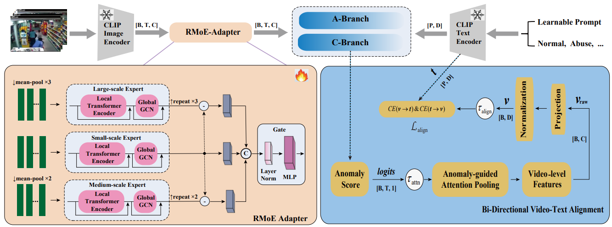

# REBA-WSVAD

This is the official Pytorch implementation of our paper: "REBA: Residual Mixture-of-Experts and Bidirectional Video–Text Alignment for Better Fine-grained Weakly Supervised Video Anomaly Detection" in CVPR 2026 findings track.

Chengxi Chu Nurul Japar* Chee Kau Lim

Faculty of Computer Science and Information Technology, Universiti Malaya

## Environment
The code is developed under the following environment:
- OS: Windows 10 Pro
- PyTorch: 2.6.0
- CUDA: 11.8
- Python: 3.10
- Main dependencies:
  - numpy>=1.23
  - scipy>=1.10
  - scikit-learn>=1.2
  - opencv-python>=4.8
  - Pillow>=9.0
  - matplotlib>=3.7
  - tqdm>=4.65
  - einops>=0.7
  - ftfy>=6.1
  - regex>=2023.0.0
  - pandas>=1.5
  - pyyaml>=6.0
  - torchvision

## Train and Test
Run the following commands:

######################## UCF-Crime ###################

training: python ucf_train.py

Inference: python ucf_test.py

######################## XD-Violence ###################

training: python xd_train.py

Inference: python xd_test.py

## Features
The pre-extracted CLIP features for the UCF-Crime and XD-Violence datasets can be downloaded from the following link:
(https://github.com/nwpu-zxr/VadCLIP)
After downloading, place the feature files in the corresponding dataset.

## Pretrained Models
We provide the pretrained models for reproducibility.
| Dataset | Download |
|--------|---------|
| UCF-Crime | [Google Drive](https://drive.google.com/drive/folders/1E7pHAeSJ2vuX1VRhEYfwqwIdI-uL92nH) |
| XD-Violence | [Google Drive](https://drive.google.com/drive/folders/1E7pHAeSJ2vuX1VRhEYfwqwIdI-uL92nH) |

After downloading the models, place them into the `model/` directory.

## References
Parts of the implementation are adapted from the following repositories:
- [VADCLIP](https://github.com/nwpu-zxr/VadCLIP)
- [DeepMIL](https://github.com/Roc-Ng/DeepMIL)
  
We thank the authors for making their code publicly available.

